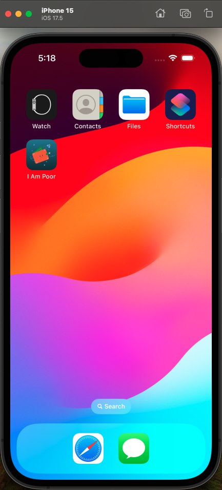
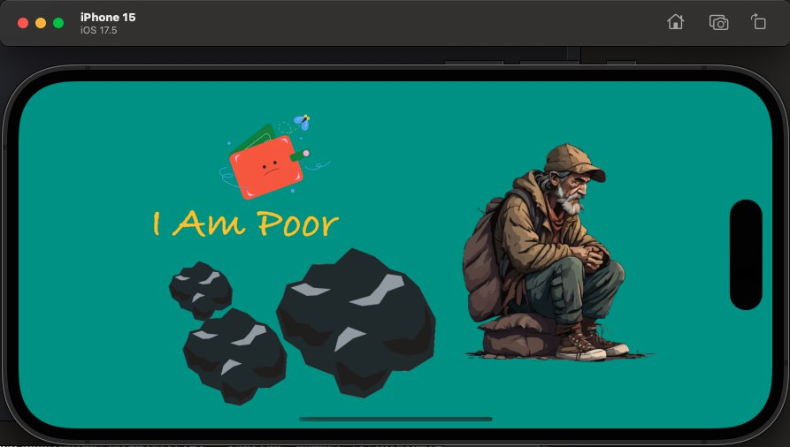
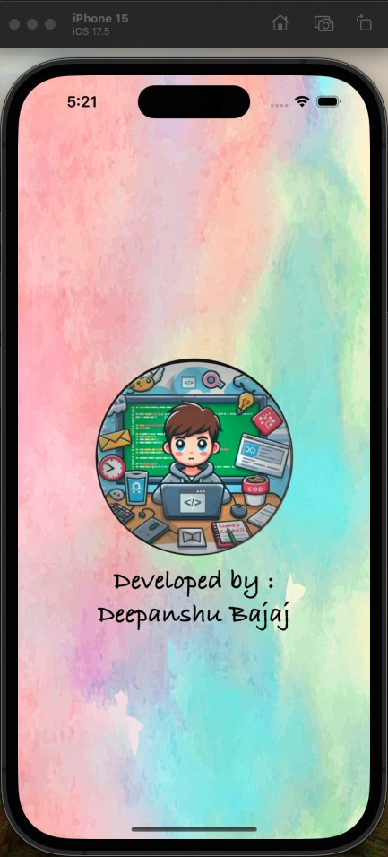
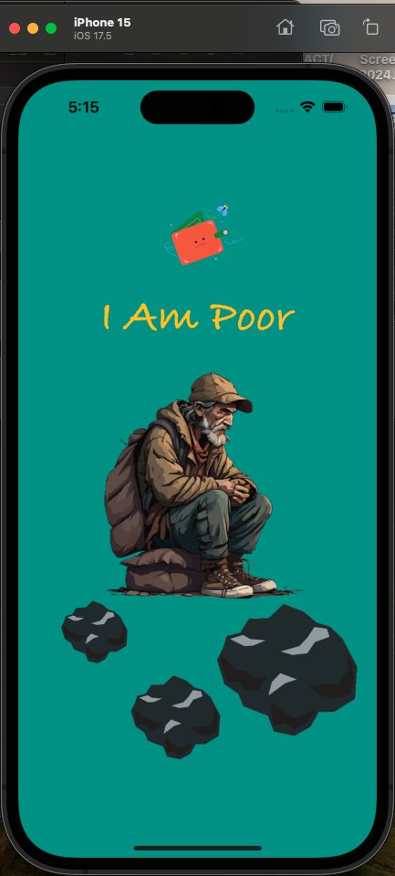

<h1 align="center">I Am Poor - iOS App</h1>

**I Am Poor** is a simple iOS application built using Swift and Xcode. The app displays the message **"I am Poor"** along with some humorous images representing a "poor" theme. It demonstrates the use of programmatic UI layout with constraints in Swift.

## Features :

- **Main Screen**: Displays the text **"I am Poor"** with associated poor-themed images.
- **Programmatic UI**: The app uses programmatically applied constraints for UI elements, providing full control over the layout.
- **Splash Screen**: A custom splash screen appears when the app is first launched.
- **App Icon**: A unique icon representing the theme of the app.

## Installation :

To run this project locally:

1. Clone the repository:
    ```bash
    git clone https://github.com/deepanshubajaj/I-Am-Poor.git
    ```
2. Open the project in Xcode:
    ```bash
    open I Am Poor.xcodeproj
    ```
3. Run the app on a simulator or physical device.

> Configure the project appropriately.

## App Look :

<p align="center">
  
  *App snapshot in the simulator.*
</p>

## Screenshots :

<p align="center">
  
  *Splash screen displayed upon app launch in Landscape mode.*
</p>

<p align="center">
  
  *Screenshot of the main screen showing the "I am Poor" text and associated image in Landscape mode.*
</p>

<p align="center">
  
  
</p>

<p align="center">
  *Splash screen displayed upon app launch in Portrait mode.* &nbsp;&nbsp; *Screenshot of the main screen in Portrait mode.*
</p>

## App Icon :

<p align="center">
  
  *The app icon represents the theme of the app.*
</p>

## Video Demo :

Here’s a short video showcasing the app's functionality:

<p align="center">
  
</p>

[Watch Working Video](ProjectOutputs/WorkingVideo/workingVideo.mov)


